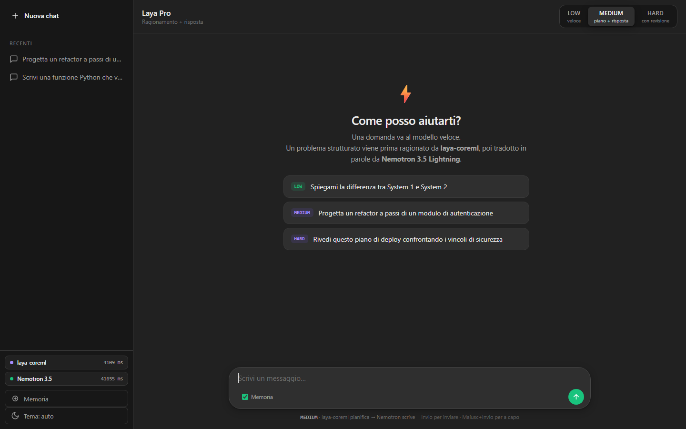
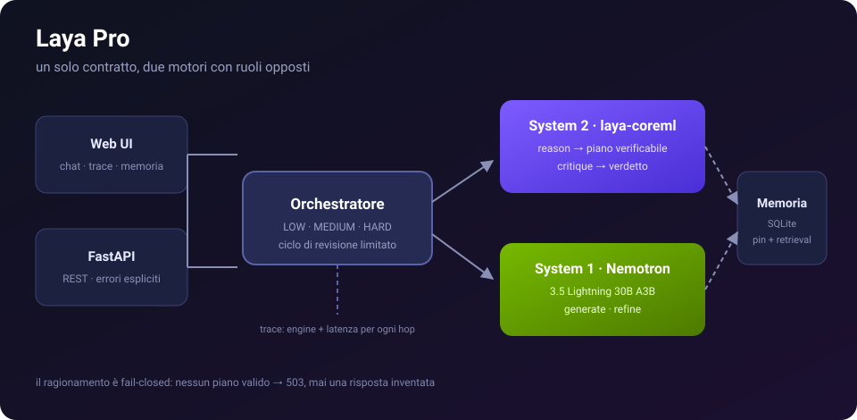
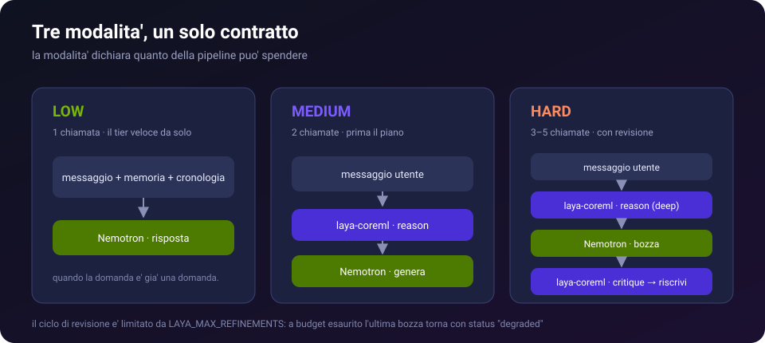
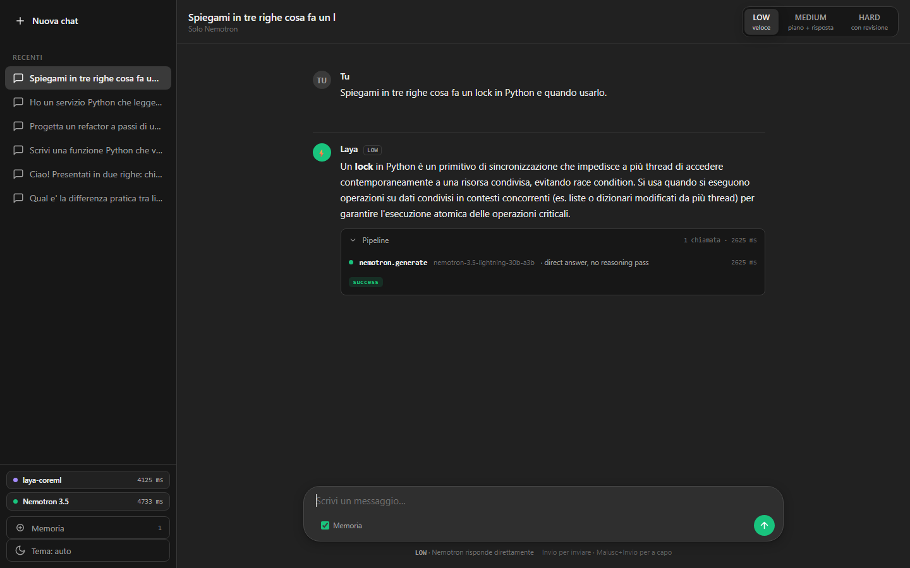
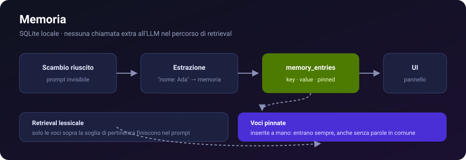
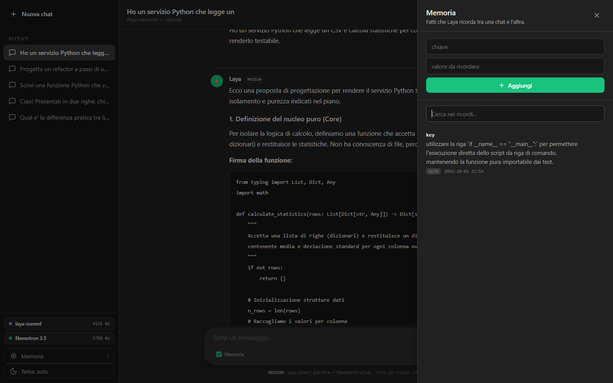

<div align="center">

# ⚡ Laya Pro

**Orchestratore ibrido System 1 / System 2** — il ragionamento decide *cosa* dire, il modello veloce si limita a *dirlo*.

[](https://github.com/mareknardella-lgtm/laya-pro/actions/workflows/ci.yml)
[](https://www.python.org/)
[](https://fastapi.tiangolo.com/)
[](LICENSE)
[](https://build.nvidia.com/nvidia_nemotron-3-5)

</div>



---

## Indice

- [Che cos'è](#che-cosè)
- [Architettura](#architettura)
- [Le tre modalità](#le-tre-modalità)
- [Avvio rapido](#avvio-rapido)
- [Configurazione](#configurazione)
- [API](#api)
- [Memoria](#memoria)
- [Struttura del progetto](#struttura-del-progetto)
- [Test e CI](#test-e-ci)
- [Stato reale del progetto](#stato-reale-del-progetto)
- [Documentazione](#documentazione)
- [Contribuire](#contribuire)

---

## Che cos'è

Due modelli con ruoli opposti, un solo contratto:

| | Motore | Ruolo |
|---|---|---|
| **System 2** | **laya-coreml** | ragionamento profondo: scompone il problema in un piano verificabile, giudica la bozza |
| **System 1** | **Nemotron 3.5 Lightning** (`nvidia/nemotron-3.5-lightning-30b-a3b`) | generazione veloce: trasforma il piano in una risposta naturale |

L'orchestratore **non sceglie** un motore: li **fuse**. Ogni risposta porta con sé un `trace` che elenca ogni hop con motore e latenza — il costo della fusione è visibile, non sottinteso.

```
                    ┌──────────────┐
  domanda  ────────▶│  orchestratore│──▶ risposta + trace
                    └──────┬───────┘
                 ┌─────────┴─────────┐
                 ▼                   ▼
        laya-coreml.reason     nemotron.generate
        (piano, confidenza)    (testo per l'utente)
                 │                   │
                 └──── nemotron.critique / refine ────┘
```

---

## Architettura



- **Backend FastAPI** ([`backend/app/main.py`](backend/app/main.py)) — API REST asincrona, errori espliciti.
- **Orchestratore** ([`backend/app/chat/orchestrator.py`](backend/app/chat/orchestrator.py)) — memoria, contesto, i due motori, ciclo di revisione.
- **Adattatore System 2** ([`backend/app/systems/laya/`](backend/app/systems/laya)) — contratto tipizzato `ReasoningPlan` / `Critique`, **fail-closed**.
- **Adattatore System 1** ([`backend/app/systems/nemotron/`](backend/app/systems/nemotron)) — contratto tipizzato `GenerationResponse`, fail-closed.
- **Memoria** ([`backend/app/memory/`](backend/app/memory)) — estrazione dei fatti, retrieval lessicale.
- **Persistenza** ([`backend/app/storage/sqlite.py`](backend/app/storage/sqlite.py)) — `chat_sessions`, `chat_messages`, `memory_entries`, `orchestration_traces`.

Tre regole che il codice rispetta sempre:

1. **Nessuna risposta fabbricata.** Ogni output di un motore è validato da Pydantic; un contratto violato diventa `502`, mai un default silenzioso.
2. **Il ragionamento è fail-closed.** Se laya-coreml non risponde, MEDIUM e HARD falliscono con `503`: il tier veloce non finge di aver ragionato.
3. **La memoria non blocca mai.** Un errore di retrieval degrada la risposta, non la impedisce.

---

## Le tre modalità



| Modalità | Pipeline | Chiamate | Quando |
|---|---|---|---|
| **LOW** | `nemotron.generate` | 1 | la domanda è già una domanda |
| **MEDIUM** | `laya.reason` → `nemotron.generate` | 2 | il problema va scomposto |
| **HARD** | `laya.reason` → `nemotron.generate` → `laya.critique` → `nemotron.generate` | 3–5 | la bozza va verificata e riscritta |

Il ciclo di revisione di HARD è **limitato** da `LAYA_MAX_REFINEMENTS`: a budget esaurito l'ultima bozza torna comunque, con `status: "degraded"`. Una risposta imperfetta dichiarata batte una risposta bloccata.

Se il critico non è raggiungibile, l'orchestratore usa il tier veloce come critico testuale e **lo dichiara nel trace**: un giudizio più debole è utile, un giudizio mal dichiarato no.

<details>
<summary><b>Cosa vedi quando espandi «Pipeline»</b></summary>



Ogni riga è un hop reale: nome dello stadio, motore che l'ha eseguito, dettaglio e latenza misurata.

</details>

---

## Avvio rapido

```bash
git clone https://github.com/mareknardella-lgtm/laya-pro.git
cd laya-pro

python -m venv .venv
# Windows:     .venv\Scripts\Activate.ps1
# macOS/Linux: source .venv/bin/activate

pip install -r requirements.txt

copy .env.example .env     # Windows
cp .env.example .env       # macOS / Linux
# poi inserisci la tua chiave NVIDIA in NEMOTRON_API_KEY

python run.py --with-stub
```

Apri **<http://127.0.0.1:8000>**.

- `--with-stub` avvia anche lo **stand-in di laya-coreml** in un processo separato: senza di esso funziona solo LOW, MEDIUM e HARD rispondono `503`.
- Su Windows c'è anche [`start.bat`](start.bat) (doppio clic).
- `run.py` funziona **da qualsiasi directory**: fissa `sys.path` e working directory sulla root del progetto.

Guide passo passo: [Windows](docs/INSTALLATION_WINDOWS.md) · [macOS / Linux](docs/INSTALLATION_MACOS.md)

---

## Configurazione

Tutto passa da `.env` (copiato da [`.env.example`](.env.example)). Precedenza: **variabile d'ambiente > `.env` > default**.

### System 1 — Nemotron (generazione veloce)

| Variabile | Default | Note |
|---|---|---|
| `NEMOTRON_API_KEY` | — | **obbligatoria**, da [build.nvidia.com](https://build.nvidia.com/) |
| `NEMOTRON_BASE_URL` | `https://integrate.api.nvidia.com/v1` | OpenAI-compatible |
| `NEMOTRON_MODEL` | `nvidia/nemotron-3.5-lightning-30b-a3b` | |
| `NEMOTRON_TIMEOUT_SECONDS` | `120` | misurato, non indovinato: vedi [Stato reale](#stato-reale-del-progetto) |
| `NEMOTRON_MAX_OUTPUT_TOKENS` | `800` | sotto ~600 il ragionamento resta a metà e la risposta torna troncata |
| `NEMOTRON_TEMPERATURE` | `0.3` | |
| `NEMOTRON_ENABLE_THINKING` | `false` | **lascialo false**: è un modello reasoning, acceso consuma centinaia di token e traccia il pensiero nel testo |

### System 2 — laya-coreml (ragionamento)

| Variabile | Default | Note |
|---|---|---|
| `LAYA_COREML_URL` | `http://127.0.0.1:8081` | contratto HTTP: `/health`, `/v1/reason`, `/v1/critique` |
| `LAYA_COREML_API_KEY` | — | opzionale |
| `LAYA_COREML_TIMEOUT_SECONDS` | `120` | |
| `LAYA_COREML_MAX_INPUT_CHARS` | `12000` | |
| `LAYA_MAX_REFINEMENTS` | `2` | round di revisione di HARD |

### Storage e servizio

| Variabile | Default | Note |
|---|---|---|
| `LAYA_DB_PATH` | `./data/laya.db` | SQLite, gitignored |
| `LAYA_HOST` / `LAYA_PORT` | `127.0.0.1` / `8000` | |
| `LAYA_LOG_LEVEL` | `INFO` | |

Ogni campo accetta anche i prefissi legacy `COREML_*` e `NEMOTRON_*`: una configurazione vecchia non si rompe all'improvviso.

---

## API

```bash
curl -X POST http://127.0.0.1:8000/chat \
  -H "Content-Type: application/json" \
  -d '{"message": "Progetta i passi per rendere testabile un servizio che legge un CSV", "tier": "MEDIUM"}'
```

```json
{
  "text": "Ecco una proposta di progettazione...",
  "tier": "MEDIUM",
  "status": "success",
  "engines_used": ["laya-coreml", "nvidia/nemotron-3.5-lightning-30b-a3b"],
  "confidence": 0.95,
  "refinements": 0,
  "trace": [
    { "stage": "laya.reason",      "engine": "laya-coreml", "latency_ms": 4125 },
    { "stage": "nemotron.generate","engine": "nvidia/nemotron-3.5-lightning-30b-a3b", "latency_ms": 4858 }
  ]
}
```

| Endpoint | Effetto |
|---|---|
| `POST /chat` | esegue la pipeline ibrida e restituisce `trace[]` |
| `GET /status` | stato reale dei motori: tentativi, successi, fallimenti, latenza media, ultimo errore |
| `GET/POST/PUT/DELETE /memory` | gestione dei fatti (`POST` crea **e pinna**) |
| `POST /memory/query` | retrieval lessicale |
| `GET /sessions`, `/sessions/{id}/messages`, `/sessions/{id}/traces` | cronologia e trace persistiti |

Codici: `422` richiesta non valida · `502` un motore ha rotto il contratto · `503` laya-coreml irraggiungibile o Nemotron non configurato.

Dettaglio completo: [docs/API_REFERENCE.md](docs/API_REFERENCE.md)

---

## Memoria



Dopo ogni scambio riuscito il tier veloce riceve un prompt **invisibile** che estrae i fatti durevoli (`nome: Ada`) e li scrive in SQLite. Il **retrieval è lessicale**, non una chiamata extra all'LLM: mantiene la memoria fuori dal budget di latenza.

Le voci **pinnate** (quelle inserite a mano dal pannello) finiscono nel prompt **sempre**, anche se la domanda non ha parole in comune.



> Guida completa: [docs/MEMORY.md](docs/MEMORY.md)

---

## Struttura del progetto

```
run.py                      launcher (funziona da qualsiasi directory)
start.bat                   avvio con doppio clic su Windows
tools/laya_coreml_stub.py   stand-in del runtime di ragionamento
backend/app/
  main.py                   app FastAPI, mount della UI, gestione errori
  config.py                 impostazioni (env + .env + default)
  container.py              wiring e costruzione dei componenti
  chat/                     orchestratore, modelli, cronologia
  systems/laya/             adattatore System 2
  systems/nemotron/         adattatore System 1
  memory/                   estrazione e retrieval
  storage/sqlite.py         schema e connessione
  observability/runtime.py  stato e latenze dei motori
  api/routes/               chat, status, memory, sessions
  static/                   UI (nessun build step)
backend/tests/              106 test
docs/                       documentazione e immagini
```

---

## Test e CI

```bash
python -m pytest backend/tests -q     # 106 passed
```

La suite non tocca la rete: client Nemotron e stand-in sono mockati. La CI ([`.github/workflows/ci.yml`](.github/workflows/ci.yml)) esegue i test su **Python 3.9** e uno smoke test del launcher lanciato da un'altra directory — perché è già successo di pubblicare un `run.py` rotto che si accorgeva solo con `--help`.

---

## Stato reale del progetto

Leggi questa sezione prima di farti domande sull'architettura.

**1. laya-coreml oggi è uno stand-in, non un runtime Core ML.**
`tools/laya_coreml_stub.py` rispetta il contratto HTTP ma chiama a sua volta Nemotron su internet, e firma ogni piano `engine: "laya-coreml-stub"` — nel trace lo vedi. La separazione System 1 / System 2 è quindi **architetturale, non di calcolo**: sostituire lo stand-in con il runtime vero è un cambio di implementazione dietro la stessa interfaccia, e nient'altro. Contratto: [docs/LAYA_COREML_STUB.md](docs/LAYA_COREML_STUB.md).

**2. L'endpoint NVIDIA trial è un'istanza condivisa.**
La stessa identica richiesta misurata su questo progetto:

| Scenario | Latenza osservata |
|---|---|
| istanza calda | 2,6 – 9 s |
| dopo ~20 s di inattività | 40 – 50 s |
| a freddo | 105 – 147 s |

Non è un problema di trasporto asincrono: sono cold start dell'istanza condivisa. Perciò il timeout di default è 120 s. Con un endpoint NIM dedicato (o un NIM self-hosted con GPU) la latenza scende di ordini di grandezza: **misurala e abbassa `NEMOTRON_TIMEOUT_SECONDS`**.

**3. Il modello a volte perde il JSON.**
Su ~10 piani richiesti, 1 non ha restituito JSON utilizzabile e la richiesta è fallita con `422` invece di inventare un piano. È il comportamento voluto (fail-closed), ma è una fonte di errori percepiti: [docs/TROUBLESHOOTING.md](docs/TROUBLESHOOTING.md).

**4. Nessun account, nessun servizio esterno oltre NVIDIA.**
SQLite in `./data/laya.db`, chiave solo in `.env`.

---

## Documentazione

| Documento | Contenuto |
|---|---|
| [ARCHITECTURE.md](docs/ARCHITECTURE.md) | come i motori si integrano, fail-closed, diagrammi Mermaid |
| [AI_MODES.md](docs/AI_MODES.md) | LOW / MEDIUM / HARD in dettaglio |
| [API_REFERENCE.md](docs/API_REFERENCE.md) | endpoint, payload, codici di errore |
| [MEMORY.md](docs/MEMORY.md) | estrazione, retrieval, voci pinnate |
| [PROVIDERS.md](docs/PROVIDERS.md) | configurazione dei provider |
| [LAYA_COREML_STUB.md](docs/LAYA_COREML_STUB.md) | il contratto che un runtime Core ML deve rispettare |
| [TROUBLESHOOTING.md](docs/TROUBLESHOOTING.md) | errori comuni e come leggerli |
| [DEVELOPMENT.md](docs/DEVELOPMENT.md) | ambiente di sviluppo, test, regole del codice |
| [INSTALLATION_WINDOWS.md](docs/INSTALLATION_WINDOWS.md) · [INSTALLATION_MACOS.md](docs/INSTALLATION_MACOS.md) | installazione passo passo |

---

## Contribuire

Fork, branch, PR — i dettagli in [CONTRIBUTING.md](CONTRIBUTING.md).
Prima di aprire una PR: `python -m pytest backend/tests -q` deve essere verde.

## Licenza

[Apache License 2.0](LICENSE) · vedi anche [NOTICE](NOTICE) e [CHANGELOG.md](CHANGELOG.md).

## Sicurezza

`.env` e `data/` sono gitignored: la chiave NVIDIA non entra mai nel repository. Politica: [SECURITY.md](SECURITY.md).

<sub>Costruito misurando, non ipotizzando: ogni latenza e ogni default in questo README è un numero letto da una risposta reale dell'API.</sub>