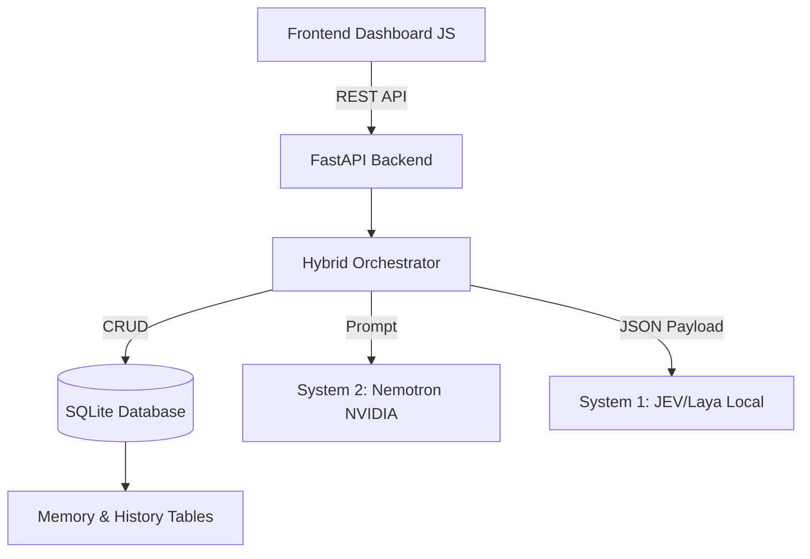
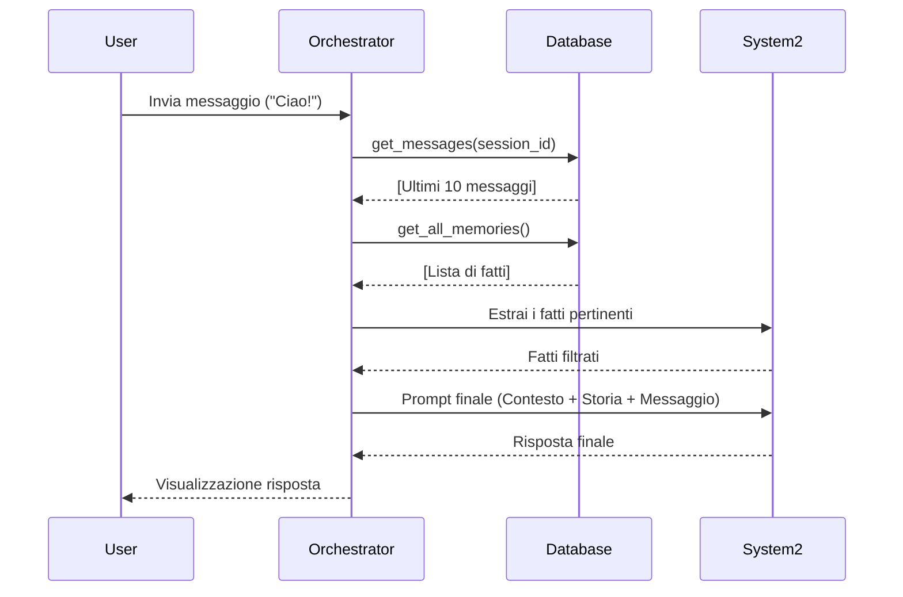
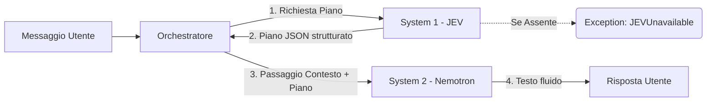

# Architettura di Laya Pro

Laya Pro è una piattaforma AI modulare che implementa il pattern ibrido "System 1 / System 2" per trasformare le richieste dell'utente in esecuzioni strutturate (JEV) o testo libero (Nemotron).

## A. Panoramica Generale

Il progetto è strutturato intorno a un **Hybrid Orchestrator** nel backend FastAPI, servito da un database SQLite e governato da un design modulare a provider multipli.

- **Frontend & Dashboard**: Applicazione Single Page (Vanilla JS, HTML, CSS) ospitata staticamente da FastAPI. Fornisce l'interfaccia Chat, il rendering dello stato e il pannello di gestione Memoria e Workflows.
- **Backend FastAPI**: Servizio Python asincrono che espone API RESTful.
- **Hybrid Orchestrator**: Coordinatore principale situato in `backend/app/chat/orchestrator.py`. Analizza la richiesta, estrae il contesto di memoria (RAG) e la instrada verso il motore AI corretto.
- **System 1 (JEV/Laya Local)**: Un motore decisionale veloce non-autoregressivo e strutturato (basato sul modello Laya). Responsabile del routing, autorizzazione, policy e pianificazione. (Spesso esegue task offline tramite PyTorch).
- **System 2 (Nemotron)**: Un LLM di grandi dimensioni (`nemotron-4-340b-instruct`) fornito dall'API NVIDIA, dedicato al ragionamento profondo e alla generazione linguistica naturale.
- **SQLite Database**: Gestisce `chat_sessions`, `chat_messages` e `memory_entries`.

---

## B. Flusso delle Richieste (Modalità LOW, MEDIUM, HARD)

L'utente invia un messaggio tramite la UI. FastAPI instrada il payload all'Orchestratore, il quale si comporta diversamente a seconda della modalità selezionata:

1. **LOW (Risposta Diretta)**
   - Viene interpellato esclusivamente System 2 (Nemotron).
   - È la modalità conversazionale pura. L'Orchestratore recupera la memoria a lungo termine, la aggiunge come System Prompt e chiede a Nemotron di rispondere all'utente.
   - *Stato effettivo: Operativo.*

2. **MEDIUM (Collaborazione)**
   - L'Orchestratore chiede a **System 1 (JEV)** di creare un piano d'azione rapido e strutturato.
   - Il piano strutturato (in JSON) viene quindi passato al contesto di Nemotron, il quale lo converte in risposta umana o ne valida la logica.
   - *Stato effettivo: JEV attualmente risponde con `JEVUnavailable` nel codice, fungendo da fail-safe finché il backend locale PyTorch non è online.*

3. **HARD (Pianificazione Approfondita)**
   - Simile a Medium, ma JEV viene incaricato di scomporre il problema in sotto-step complessi, verificando policy di sicurezza incrociate prima di chiamare Nemotron.
   - *Stato effettivo: Restituisce `JEVUnavailable`.*

---

## C. Componenti e Responsabilità

| Componente | Percorso | Responsabilità | Stato |
|---|---|---|---|
| **Hybrid Orchestrator** | `backend/app/chat/orchestrator.py` | Coordina memoria, chiamate a Nemotron e JEV, formatta l'output. | Operativo |
| **Nemotron Adapter** | `backend/app/systems/system2/adapter.py` | Costruisce le richieste REST per le API NVIDIA (System 2). | Operativo |
| **JEV Adapter** | `backend/app/chat/jev.py` | Gestisce i payload strutturati Pydantic verso JEV (System 1). | Parziale (`JEVUnavailable`) |
| **Memory Manager** | `backend/app/memory/manager.py` | Gestisce salvataggio e Retrieval (CRUD) della memoria RAG globale. | Operativo |
| **SQLite DB** | `backend/app/storage/sqlite.py` | Definisce tabelle per audit, workflow, chat, sessioni. | Operativo |

---

## D. Memoria e Persistenza

La memoria di Laya Pro è basata su **SQLite** (non usa veri indici vettoriali, ma un approccio Retrieval semantico filtrato tramite l'LLM stesso per semplicità architetturale out-of-the-box).

- **Chat History**: Ogni messaggio viene salvato in `chat_messages` con una `session_id`. Se chiudi il browser e lo riapri, FastAPI ricostruisce la schermata rileggendo la history.
- **RAG (Long-Term Memory)**: Se abilitato dalla UI ("Memoria Auto"), dopo ogni scambio andato a buon fine, l'Orchestratore invia un prompt invisibile a Nemotron per "estrarre fatti permanenti" dalla chat. I fatti vengono salvati in `memory_entries` con scope globale.
- Durante le chat successive, Laya richiama i ricordi e passa l'intero pacchetto all'LLM chiedendogli di filtrare e usare solo quelli pertinenti al messaggio attuale.

---

## E. Diagrammi (Mermaid)

### 1. Architettura Generale

### 2. Flusso di Recupero Memoria (RAG)

### 3. Collaborazione Inter-Modello (Modalità MEDIUM)

