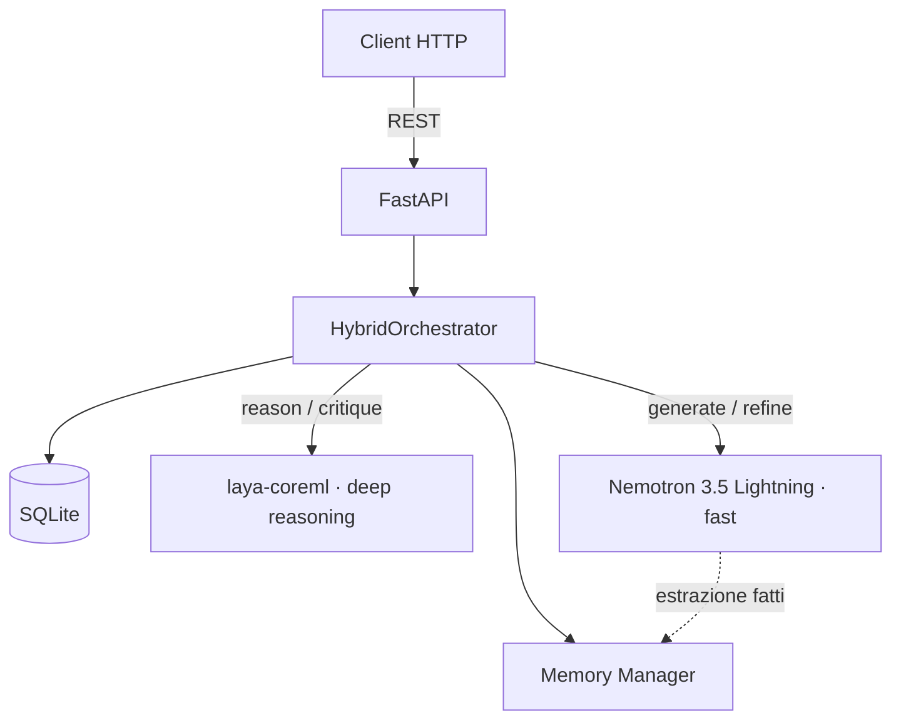
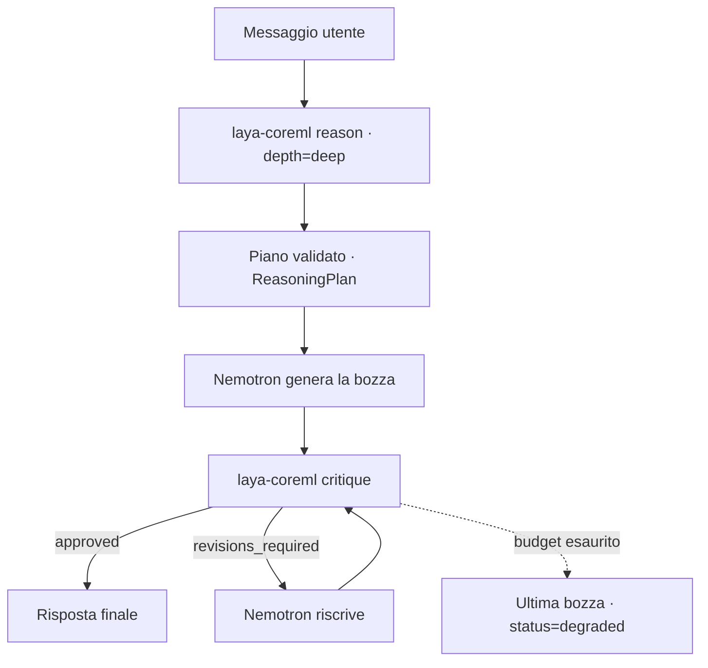
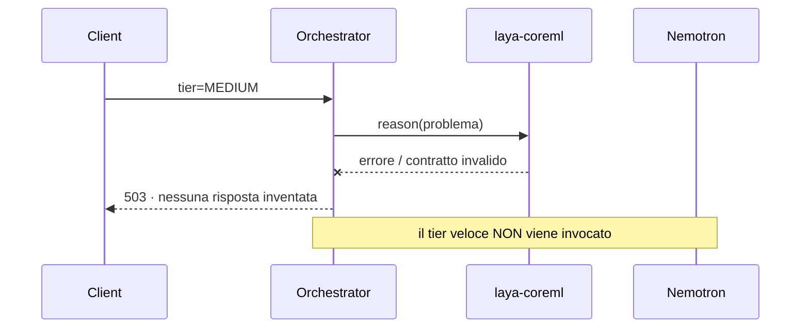

# Architettura di Laya Pro

Laya Pro è una piattaforma AI modulare che unisce due motori con ruoli opposti:

- **System 1 — Nemotron 3.5 Lightning** (`nvidia/nemotron-3.5-lightning-30b-a3b`): modello MoE a bassissima latenza, usato per generare il testo finale.
- **System 2 — laya-coreml**: runtime di ragionamento profondo locale (Core ML), che produce piani verificabili e giudica le risposte.

L'orchestratore non sceglie un motore: li **fuse**. Il ragionamento profondo decide *cosa* dire, il modello veloce si limita a *dirlo* nel minor tempo possibile.

## A. Panoramica Generale

- **Backend FastAPI** (`backend/app/main.py`): API REST asincrona.
- **Hybrid Orchestrator** (`backend/app/chat/orchestrator.py`): coordina memoria, contesto, i due motori e il ciclo di revisione.
- **laya-coreml Adapter** (`backend/app/systems/laya/`): contratto tipizzato `ReasoningPlan` + `Critique`, fail-closed.
- **Nemotron Adapter** (`backend/app/systems/nemotron/`): contratto tipizzato `GenerationResponse`, fail-closed.
- **Memory Manager** (`backend/app/memory/`): estrazione dei fatti e retrieval lessicale su SQLite.
- **SQLite** (`backend/app/storage/sqlite.py`): `chat_sessions`, `chat_messages`, `memory_entries`, `orchestration_traces`.

---

## B. Flusso delle Richieste

| Modalità | Pipeline | Chiamate | Latenza tipica |
|---|---|---|---|
| **LOW** | `Nemotron` | 1 (+1 estrazione memoria) | minima |
| **MEDIUM** | `laya-coreml.reason` → `Nemotron` | 2 (+1) | media |
| **HARD** | `laya-coreml.reason` → `Nemotron` → `laya-coreml.critique` → `Nemotron` (revisione) | 3–5 (+1) | alta, ma controllata |

**LOW** — il messaggio va diretto al tier veloce con contesto di memoria e cronologia. Nessun passaggio di ragionamento: nulla da giustificare.

**MEDIUM** — laya-coreml scompone il problema in passi. Il piano (JSON validato da Pydantic) viene iniettato nel prompt del tier veloce, che lo trasforma in risposta naturale.

**HARD** — come MEDIUM ma con piano profondo (`depth: deep`, almeno due passi). Il piano diventa anche contratto di verifica: la bozza viene passata al critico, che restituisce un verdetto strutturato (`approved`, `revisions_required`, `rejected`). In caso di `revisions_required` il tier veloce riscrive la risposta tenendo conto dei problemi elencati, e il ciclo ripete.

Il ciclo di revisione è **sempre limitato** da `LAYA_MAX_REFINEMENTS`. A esaurimento budget l'ultima bozza viene comunque restituita, con `status: "degraded"`: è preferibile una risposta imperfetta dichiarata a una risposta bloccata.

### Fallback del critico
Se `laya-coreml.critique` non è raggiungibile, l'orchestratore usa il tier veloce come critico testuale (`APPROVED` oppure righe `GAP: ...`). Il trace registra esplicitamente quale motore ha giudicato: un giudizio più debole è utile, un giudizio dichiarato male no.

---

## C. Principi di progetto

1. **Fail-closed sul ragionamento.** Se laya-coreml non produce un piano valido, la richiesta fallisce con `503`. Non esiste un fallback "silenzioso" in cui il tier veloce risponde fingendo di aver ragionato.
2. **Il trace è parte della risposta.** Ogni hop è registrato in `ChatResponse.trace` con engine e latenza: il costo della fusione è visibile, non sottinteso.
3. **La memoria non blocca mai.** Fallimenti in retrieval o estrazione vengono loggati e ignorati; degradano la risposta, non la impediscono.
4. **Nessuna answer fabricata.** Ogni motore validato da Pydantic; ogni risposta che non rispetta il contratto diventa errore `502`, non un valore di default.

---

## D. Memoria e Persistenza

- **Cronologia**: ogni turno è salvato in `chat_messages` con `session_id`; gli ultimi 10 messaggi finiscono nel prompt successivo.
- **Estrazione**: dopo ogni scambio riuscito, il tier veloce riceve un prompt invisibile per estrarre i fatti durevoli (`nome: Ada`). Le righe `key: value` diventano righe in `memory_entries`.
- **Retrieval**: scoring lessicale deterministico, non una chiamata extra all'LLM. Tiene il percorso memoria fuori dal budget di latenza del tier veloce; entrano nel prompt solo le voci sopra una soglia di pertinenza.

---

## E. Diagrammi (Mermaid)

### 1. Architettura Generale

### 2. Flusso HARD con revisione

### 3. Fail-closed

